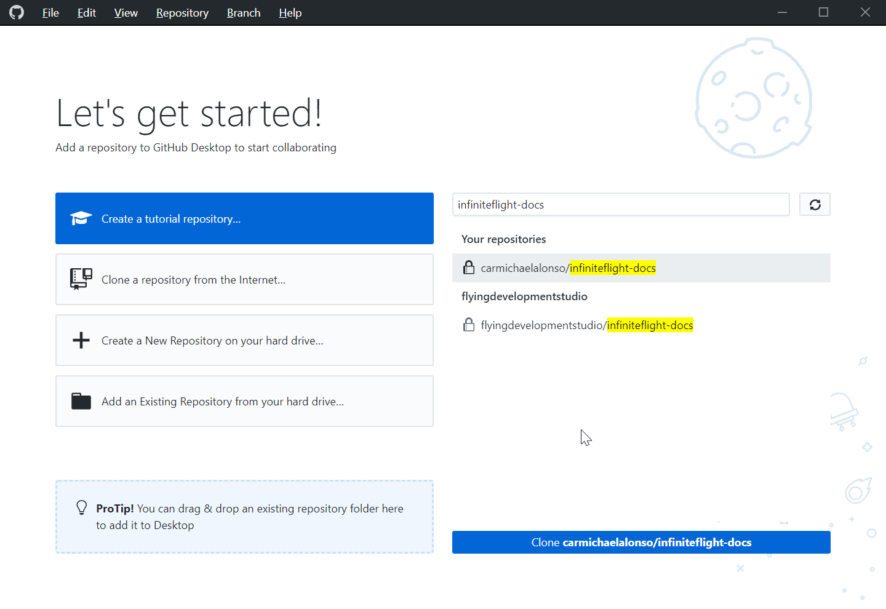
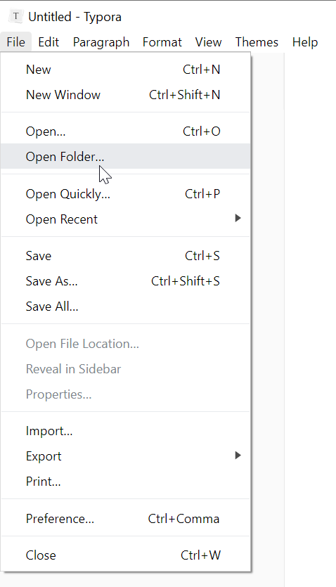

# 1. Infinite Flight Documentation


## Summary


Our documentation is written in Markdown, hosted in GitHub and rendered using our documentation component on our website. All guides are divided into different categories for organization, these are defined below:

| Category | Definition                                                   | Repository Definition |
| -------- | ------------------------------------------------------------ | --------------------- |
| Guide    | The main category that will be listed in the navigation side bar | Folder                |
| Section  | Within each guide will be a series of sections, these are shown when clicking on a guide from the navigation side bar | Sub-Folder            |
| Page     | A page is within a section and covers a specific topic, again this can be accessed by clicking on a section from the navigation side bar to show all pages contained within that section | File                  |


GitHub


- **Commit**

  A set of changes saved to the local repository. This can include multiple files changes, additions, deletions, etc.

- **Pushing a commit**

  Syncing your local repository with GitHub. This essentially means you push your changes to our common repository.


## Setting up an Editing Environment


### Programs to Install

The following programs are required:

- [Typora]( https://www.typora.io/ ) for Markdown editing.
- [GitHub Desktop]( https://desktop.github.com/ ) for syncing changes with GitHub.


### GitHub Set Up

To set up GitHub, the following steps can be followed:


Step 1

: Create a `Fork` of this repository. This creates a version of the repository that allows you to make your changes, before integrating them to the main repository. The repository will be named `[your GitHub username]/infiniteflight-docs`


Step 2

: Clone your `Fork` to your local computer. Select your forked repository (in this case, `carmichaelalonso/infiniteflight-docs`), and then press "Clone" at the bottom. Set your preferred `local path`, which is where the repository is kept on your local computer, the default option is  `Documents\GitHub\infiniteflight-docs`




### Typora Set Up

To set up Typora, the following steps can be followed:


Step 1

: Open the cloned folder in Typora



​	

Step 2

: In this case, select the ``Documents\GitHub\infiniteflight-docs` folder, which will look like this

​	


Step 3

: Toggle Tree View. Tree View allows you to see all files as they are represented by section in the repository. Select any file to open it, and it will show on the right side edit pane


Step 3

: Begin writing and refer to the style guide below. You can also right click in the edit pane to select formatting options, or insert a particular Markdown element


Step 4

: Save the file at regular intervals and before pushing to GitHub. This can be done with `Ctrl + s` or `File -> Save`.


### Creating a New Section

Step 1

: Right-click on the `infiniteflight-docs` folder


Step 2

: Create a `New Folder`


Step 3

: Name it appropriately for the section. The section name is taken by replacing `-` dashes with a space, and capitalising the first letter of each word.


### Creating a New Page

Step 1

: Right-click on a section folder


Step 2

: Create a `New File`


Step 3

: Name it appropriately:

- Do not use spaces in the file name, use `-` (dashes) instead.
- Relate it to the document title as much as possible.


### Pushing to GitHub


Step 1

: Ensure you have synced the latest changes. Press `Fetch Origin` in the top menu bar to see if there are new changes


> If there are changes, it will show a count of commits, alongside `Pull Changes`. Do this before continuing (this may give some errors if there are file conflicts, if so, contact Cam for help)


Step 2

: Commit your changes. Ensure all the changed files are selected (see the checkboxes on the left in the image above). Write a summary of changes (this should be short yet informative, so that we can look back at the file history at some point in the future), then press `Commit`


Step 3

: Push your changes. Press `Push origin` to push your commit to GitHub


## Style Guide

See  `_template.md` for an example on how to style a new page.


1. US English must be used for the documentation

   

2. Every article must contain a metadata section at the top of the file


      ```markdown
   ---
   id: getting-started
   title: Getting Started
   meta: Learn how to start a flight in Solo with Infinite Flight
   ---
      ```

   This must define these tags which are used for search engine / open graph listings. Provide a unique `id` and `title`, as well as a `meta` description of what the article is about

   

3. Every page must contain a document title. This is a top-level header, specified with one `#`

   ```markdown
   # Installing on iOS
   ```

   

4. Sub-Sections in each page must contain a second-level header, specified with two `#`

   ```markdown
   ## Minimum Device Requirements
   ```

   

5. References for a particular paragraph can be defined by including an additional `#`

   ```markdown
   ### 4.1.3
   ```

   

6. Emphasis can be defined to draw attention to particular wording

   ```markdown
   Emphasis, aka italics, with *asterisks* or _underscores_.
   
   Strong emphasis, aka bold, with **asterisks** or __underscores__.
   
   Combined emphasis with **asterisks and _underscores_**.
   
   Strikethrough uses two tildes. ~~Scratch this.~~
   ```

   >Emphasis, aka italics, with *asterisks* or _underscores_.
   >
   >Strong emphasis, aka bold, with **asterisks** or __underscores__.
   >
   >Combined emphasis with **asterisks and _underscores_**.
   >
   >Strikethrough uses two tildes. ~~Scratch this.~~

   

7. Bullet point lists can be defined to specify chunks of information, such as a sub-section summary

   ```markdown
   * A plane is made out of metal and other strong materials
   * Infinite Flight simulates planes and the look is based on the physical properties of the aircraft's material
   ```

   > - A plane is made out of metal and other strong materials
   > - Infinite Flight simulates planes and the look is based on the physical properties of the aircraft's material

   

8. Definition lists can show a list of steps in how to carry out a feature

   ```markdown
   Step 1
   : Return to your device home screen and find the Infinite Flight icon
   
   Step 2
   : Tap on the icon
           
   Step 3
   : Welcome to Infinite Flight, enjoy!
   ```

   

   

9. as

10. AS

11. as

12. AS

13. as

14. AS

15. as

16. AS

17. as

18. AS

19. s

20. 


3. **Links to other sections/pages/references are defined by the name of the section and the article.** 

   For example, a link the "installation" article in the "getting-started" section is done as follows:

   ```markdown
   See the [installation guide](/guide/getting-started/installation) for more information.
   ```

   > See the [installation guide](getting-started/installation) for more information.

   

   Links to other pages, such as the community, are defined as:

   ```markdown
   See the [tutorial](https://community.infiniteflight.com/t/infinite-flight-faq/288495) on the IFC.
   ```

   >See the [tutorial](https://community.infiniteflight.com/t/infinite-flight-faq/288495) on the IFC.

   It's best if links to pages outside of the documentation are ran by Cam/Jason.

   

4. **Images need to included in the `_images` directory so that they are pushed to the repository, and referenced in the article with a relative path** (that is, `_images/`, followed by the name of the image).

   Additionally, `Alternative Text` needs to be provided. This summarises the image in a couple of word for those who are hard of sight, as it can be read out by a screen reader. It also shows in the case the image isn't available.

   ```markdown
   
   ```

   > 

   If you are using Typora, it is recommended that you paste in an image, then use the `Copy Image To...` function (shown when you paste the image, or by right-clicking on the image).

   Make sure the path is **relative**, that is, it must begin with `_images/`.

   

5. **HTML Containers (div) can be added by wrapping content in `:::`**

   Our customized markdown has some styles associated with these containers for scenario headings and scenarios like so:

   ```markdown
   ::: scenario-heading
   This is my heading
   :::
   
   ::: scenario
   This is a longer description of the scenario [...]
   :::
   ```

6. **Technique and associated Pros/Cons tables**

   Using the class attributes `{.technique}` and `{.prosandcons}` allows us to create connected tables, provided no extra paragraph breaks are in between. These will have special styles applied to the table classes for easy viewing.

   ```markdown
   | Technique 1                                                 |
   | ------------------------------------------------------------|
   | Try to anticipate the problem by creating separation sooner rather than later | 
   | E.g. if both aircraft were downwind, rather than allowing *I-DRUM* to follow *N1DC* with [...] |
   {.technique}
   | Technique 1                                                  | Pro or Con?                       |
   | ------------------------------------------------------------ | --------------------------------- |
   | :fa-check-circle: | Could prevent a go-around |
   | :fa-times-circle: | May increase workload |
   {.prosandcons}
   ```

7. **FontAwesome Icons**

   As shown in point 12, FontAwesome icons are available, who's class name can be found at [FontAwesome](https://fontawesome.com/icons). For example, the [Clipboard Check](https://fontawesome.com/icons/clipboard-check?style=solid) icon has a class attribute of `fas fa-clipboard-check`. To use this in the documentation, use the following markdown:

   ```markdown
   :fa-clipboard-check:
   ```


11. Task Lists

    Tasks lists can be added in the same way one would [add in github](https://docs.github.com/en/issues/tracking-your-work-with-issues/creating-issues/about-task-lists). 

    ```markdown
    - [ ] List item number one
    - [ ] List item number two
    - [x] List item number three, which is checked by default
    ```


A useful reference is the [Markdown Cheatsheet]( https://github.com/adam-p/markdown-here/wiki/Markdown-Cheatsheet ).
